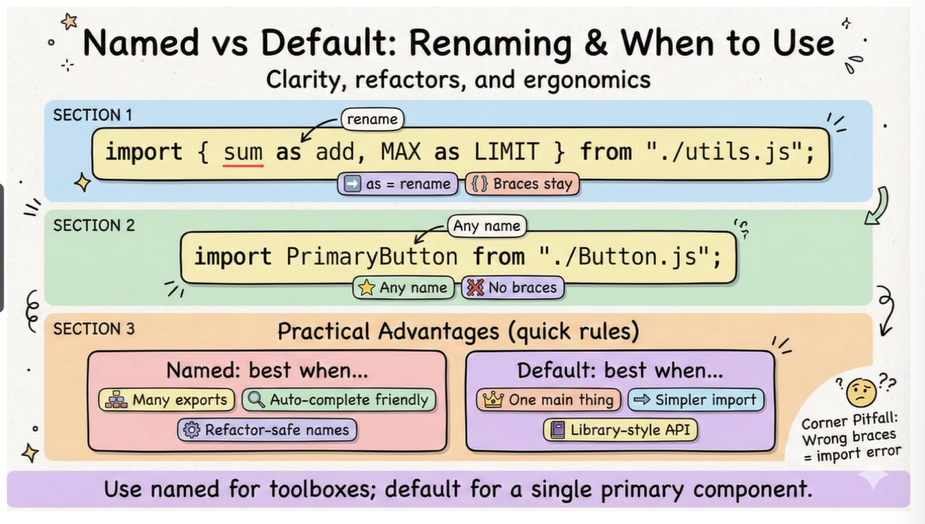
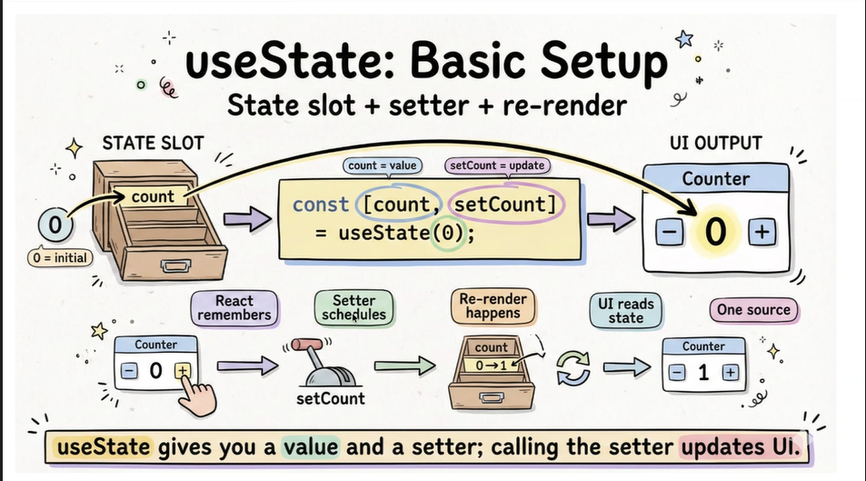
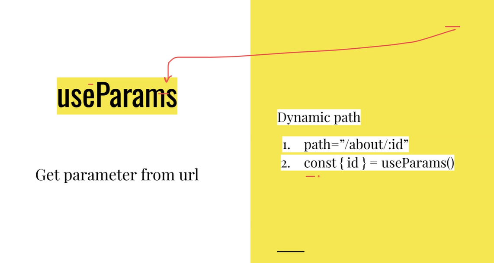
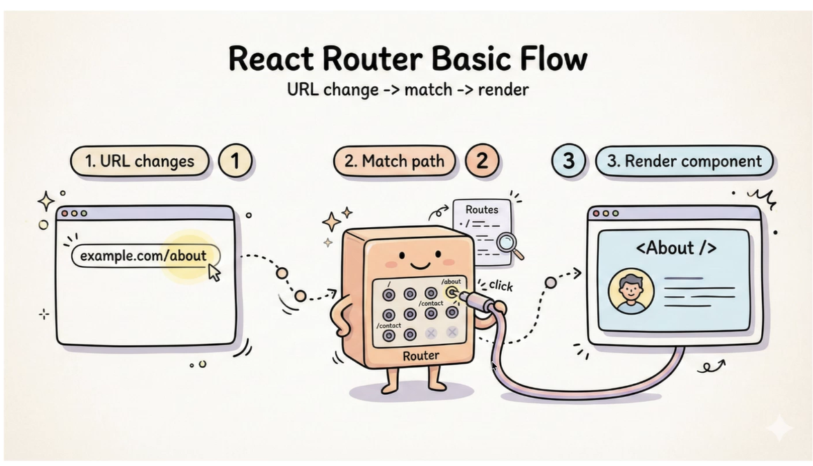
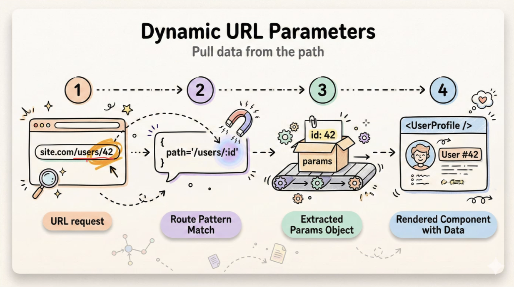
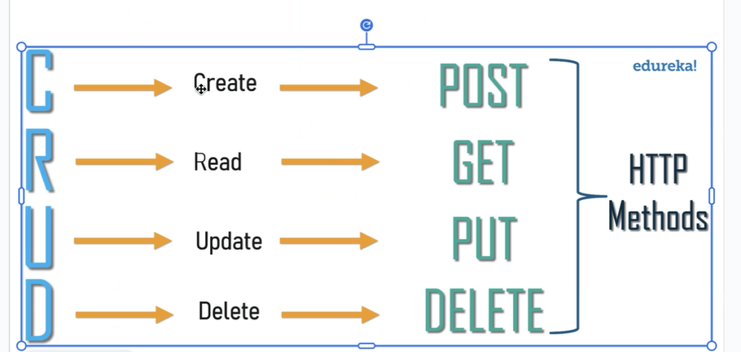
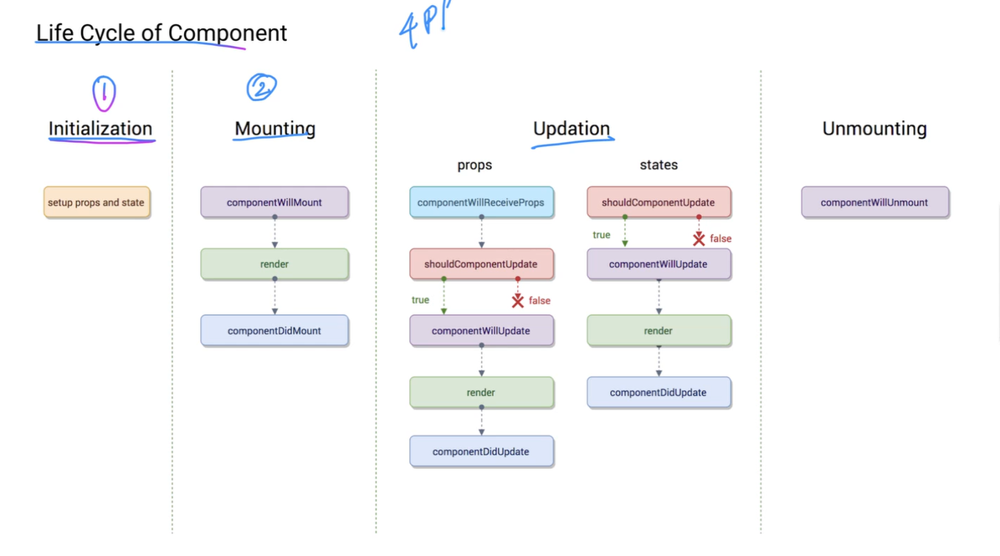
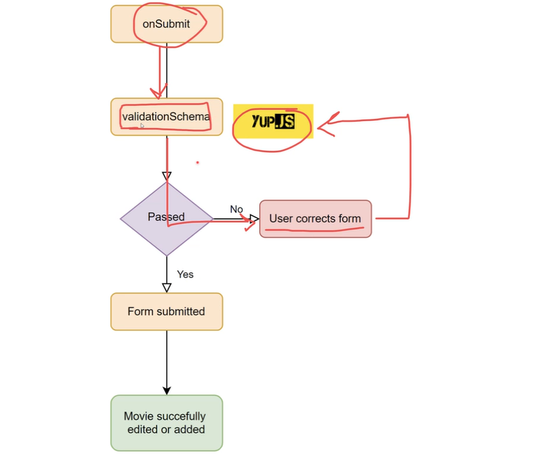

# Importing and Exporting

## Two ways of importing and exporting
- named
- default
- you can have a default and name export in one file
- you can't have more than one default export i one file
- Named is prefered because you can export multiple things

example

### Renaming
- use as to rename (not needed for default exports)

- only make a file extension jsx if the file has components

# Hook functions
- React reacts to special variables called hook variables
-  Hook is a function
-  uses the keyword "use"

### UseState
- general syntax
-  let [state , setState] = useState(Initial_Value)
-  state- current value of component
-  setState-fn updates the state

### useNavigate
- Use it when you want to change url on click of a buttion

### useParams

###
- Component is a function state
- C= f(s)- State change component re-renders(when update happens it re-draws everything)

##  Routing
- Its essentially conditional rendering
https://reactrouter.com/start/declarative/installation 

https://codesandbox.io/p/sandbox/fhwhc4?file=%2Fsrc%2FApp.js%3A15%2C50

### Dyanamic routing

## Components from google
[Click here](https://mui.com/material-ui/)

## Virtual DOM (VDOM)
- It's a copy of the real DOM which is a big object
- Batch all the updates on the virtual DOM and then patch only the updates to the Real DOM
- Updating on the REAL DOM is expensive because everytime you touch any element the other elements are affected so  thats why you update on VDOM, compae what has changed and only update the changes on the  real DOM
- Comparing + updating =reconciliation
- Comparing= diffing
- Diffing is faster if you give each element a  key
- Hooks update the virtual DOM

## Creating a mock API
[Click here](https://mockapi.io/projects/6a4ceefee1cf82a4a17dd0d7)

# HTTP methods
- POST : create
- GET : Read
- PUT : update
- DELETE : delete

## Components
There are 2 types of components
- functional components
- class components

Lifecycle of component

## HTML Forms
[click here](https://developer.mozilla.org/en-US/docs/Web/HTML/Reference/Elements/input)

## Form validation

