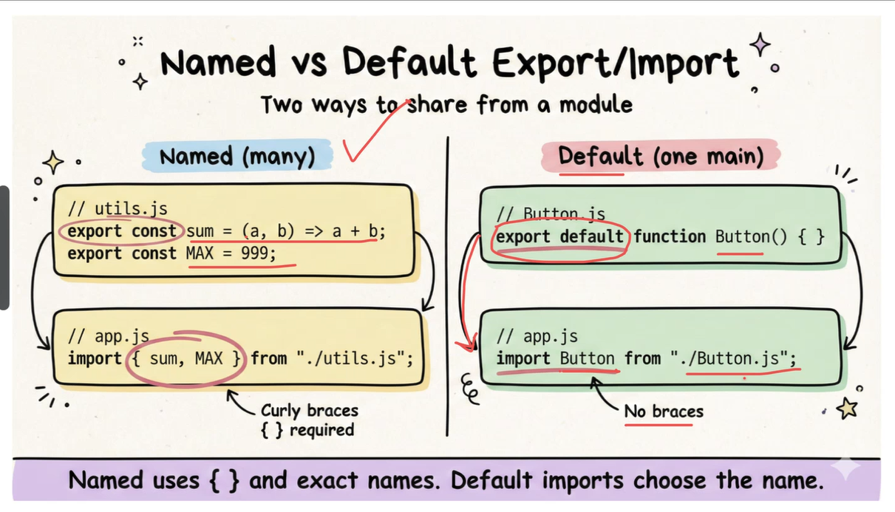
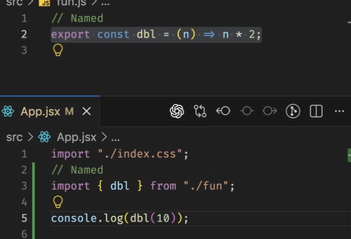

# Importing and Exporting

## Two ways of importing and exporting
- named
- default
- you can have a default and name export in one file
- you can't have more than one default export i one file
- Named is prefered because you can export multiple things

example

### Renaming
- use as to rename (not needed for default exports)

- only make a file extension jsx if the file has components